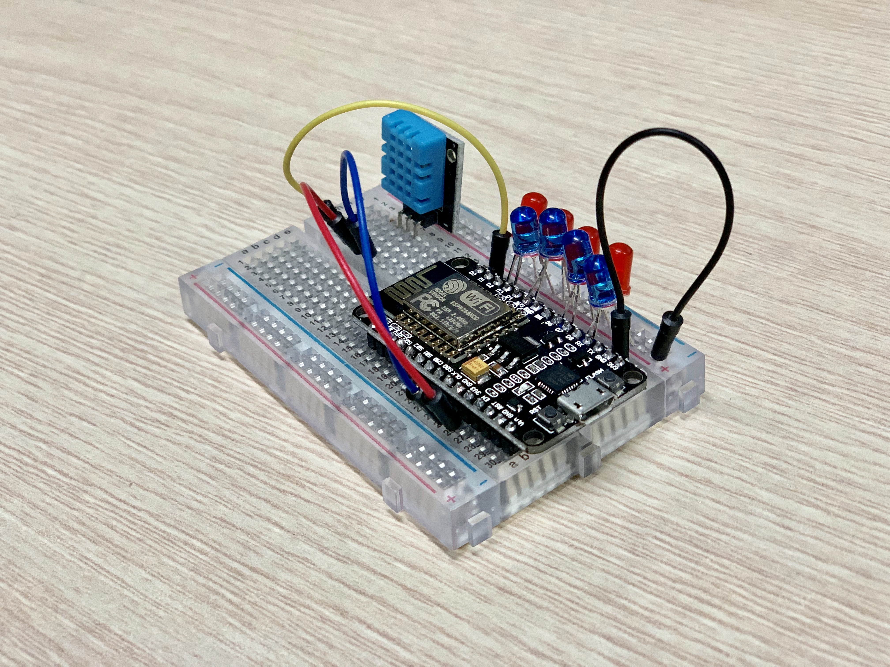
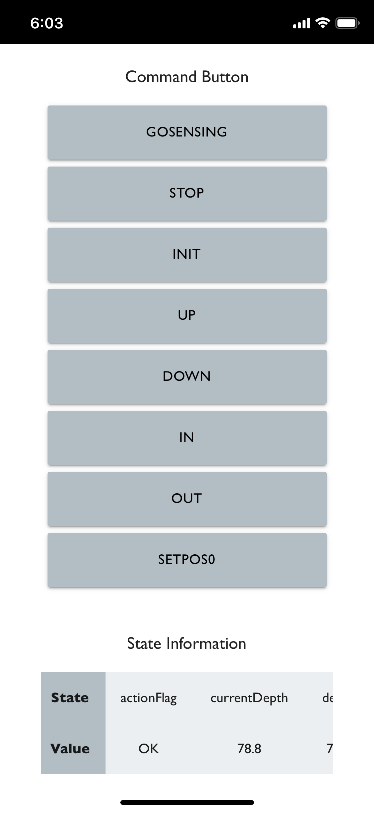

# toyproject-firebase2esp8266

> firebase와 esp8266을 사용한 토이프로젝트  

 

## 디렉토리 구성  

**/esp8266**: firebase와 통신하는 디바이스  
**/webapp**: firebase 웹앱, iOS에 최적화  

 

## 기능  

1. firebase 웹앱의 *Command 버튼*을 통해 esp8266 조작  
2. esp8266의 GPIO핀에 연결된 센서 모듈의 데이터를 firebase RealtimeDB에 저장  
3. firebase RealtimeDB에 저장된 센서 값을 웹앱에서 확인 가능  

 

## 사용 디바이스  

### esp8266  
* 디바이스: esp8266-NODEMCU  
* 센서: 온습도센서(DHT11)  

  

### Webapp  
* 테스트 디바이스: iPhone XS, iPhone 6  

 

 

## 라이센스  

[MIT 라이센스](https://github.com/sauber92/toyproject-firebase2esp8266/blob/master/LICENSE)
